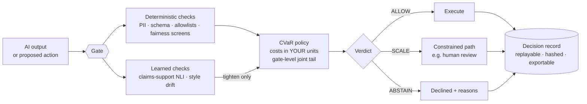

# Decision Governor

**Risk governance for AI outputs and actions: `ALLOW` / `SCALE` / `ABSTAIN`.**

[](../../actions)
[](pyproject.toml)
[](LICENSE)
[](CHANGELOG.md)
[-informational)](pyproject.toml)

Decision Governor stands between an AI system's outputs and their consequences. Every output — or proposed **action** — passes through gates that return one of three verdicts, decided by a tail-risk policy over costs *you* define in your domain's own units, with every governance decision logged in an auditable, independently re-verifiable record.

```
ALLOW    execute as proposed
SCALE    execute in constrained form — human review, reduced limits, soft-delete
ABSTAIN  decline, with reasons
```

**The design invariant everything else serves:** the core is deterministic and reproducible. Learned models (embeddings, NLI, LLM judges) participate only in roles that can *tighten* a verdict — never loosen one. A hallucination inside the Governor can cost a false abstention; it can never authorize a bad execution.

> **Status:** pre-release. Public contracts are frozen and the engine, risk interface, and check library are built and property-tested; **v0.1.0 ships August 8, 2026** on PyPI with a technical report and DOI. This repository develops against pre-registered build cards with acceptance gates — the dated execution records are in [`docs/`](docs/).

---

## Install for testing

To try the pre-release code from this repository, create an isolated environment
and install the checkout in editable mode:

```bash
python -m venv .venv
source .venv/Scripts/activate  # Git Bash on Windows
python -m pip install --upgrade pip
python -m pip install -e .
```

Run the test suite to verify the checkout:

```bash
python -m pytest -q
```

Production installation remains available with the v0.1.0 PyPI release on
August 8, 2026.

## How a decision happens



Only deterministic evidence can support `ALLOW`. With no deterministic checks in a gate, the best reachable verdict is `SCALE` — models alone cannot authorize. This is enforced *structurally* in the composition operator (and verified by ~200-example property tests), not offered as configuration.

## Quickstart

Runs verbatim on the base install: **no API keys, no LLM-provider SDKs, CPU-only.**

```python
from decision_governor import Governor, gate
from decision_governor.checks import PIILeak
from decision_governor.risk import CostStructure, CVaRPolicy

costs = CostStructure(
    pii_exposure=200.0,       # a customer identifier reaching a reader
    abstention=2.0,           # refusing is never free
)
gov = Governor(
    policy=CVaRPolicy(
        alpha=0.05,
        costs=costs,
        # Every check names the cost it puts at risk: no silent defaults.
        cost_map={"pii_leak": "pii_exposure"},
    ),
    log="decisions.db",
)
gov.register(PIILeak())      # a Governor starts empty; checks are explicit

class DemoLLM:               # stand-in, so this block runs as written
    def complete(self, prompt: str) -> str:
        return "The contract runs for three years and renews annually."

@gate(gov, checks=["pii_leak"], scale_path="human_review")
def summarize(llm, source_document: str) -> str:
    return llm.complete(f"Summarize: {source_document}")

result = summarize(DemoLLM(), source_document="Your source text here.")
if result.decision.allowed:
    print(result.output)
else:
    print(result.reasons)   # every escalation is traceable to its evidence
```

Swap `DemoLLM` for your own client and the gate is unchanged — it governs the output, not the caller.

### Part 2 — model-backed claim verification

`claims_supported` verifies the output's claims against *your* supplied fact source (grounded verification — the honest scope of hallucination screening), by pinned models whose hashes are checked at load. It is **not** in the base install:

```console
$ pip install "decision-governor[llm]"
```

Continuing from the quickstart above (the `DemoLLM` stand-in is reused):

```python
from decision_governor import Governor, gate
from decision_governor.checks import ClaimsSupported, PIILeak
from decision_governor.risk import CostStructure, CVaRPolicy

gov = Governor(
    policy=CVaRPolicy(
        alpha=0.05,
        costs=CostStructure(
            unsupported_claim=50.0,   # a fabricated fact reaching a reader
            pii_exposure=200.0,
            abstention=2.0,
        ),
        cost_map={"claims_supported": "unsupported_claim",
                  "pii_leak": "pii_exposure"},
    ),
    log="decisions.db",
)
for check in (PIILeak(), ClaimsSupported()):
    gov.register(check)

# `facts` receives the wrapped call's KEYWORD arguments and returns the
# fact source to check the output against. The fact-source argument must
# therefore be passed by keyword — as `source_document=` is below.
@gate(gov, checks=["claims_supported", "pii_leak"],
      facts=lambda kwargs: kwargs["source_document"])
def summarize(llm, source_document: str) -> str:
    return llm.complete(f"Summarize: {source_document}")

result = summarize(DemoLLM(), source_document="The contract runs for three years.")
```

Claims are checked against the fact source only — `claims_supported` never consults the open world, and never authorizes: as a learned check it can tighten a verdict, never relax one.

## Why this exists

Most guardrails return a score and leave the decision to you. Decision Governor **makes the decision**, the way an insurer would:

| Piece | What it does | Why it's built this way |
|---|---|---|
| **Cost structures** | You price each error class — and abstention — in your units | A score of 0.7 is a mood; 0.7 × $100 exposure is a decision input. Refusal must cost something, or the safe strategy is refusing everything |
| **CVaR policy** | Prices the *worst-α tail* of every action, not the average | Averages hide rare catastrophes — which is exactly where AI harm lives. Same measure banking regulators require (expected shortfall) |
| **Gate-level joint pricing** | Prices all checks *together* (exact 2ᵏ enumeration ≤12 checks; conservative comonotonic bound beyond) | Two individually-tolerable risks can be jointly intolerable. Risks can't hide by being individually small |
| **Bühlmann–Straub credibility** | Failure rates learned from history, shrunk toward the collective by evidence weight — factors (Z, n, k) always exposed | Zero failures in two trials is not a zero failure rate. Shrinkage strength is *derived from the data's variance*, not hand-picked — and the feed is tighten-biased: history may make the Governor stricter, never laxer |
| **The decision record** | Every verdict logged with scores, costs, credibility factors, model pins, context digest | So that the next row is possible → |
| **`governor audit verify`** | A stranger recomputes every deterministic verdict from the exported bundle alone | Auditability as a *property*, not an adjective |

## The audit round-trip

```console
$ governor audit export --db decisions.db -o q3_bundle/
$ governor audit verify q3_bundle/
  1,847 records · 1,847 deterministic verdicts recomputed · 0 mismatches
  model pins verified · config digest matches · PASS
```

The bundle is self-contained — records, schema, model pins, policy config, and a hash manifest whose own recipe is printed inside it. Verification re-derives verdicts from the recorded parameters with independent code (a verifier that imports the engine would share the engine's bugs). Flip one stored decision and verification fails, naming the record. Don't trust the paper — recompute it.

## It governs decisions, not documents

v0.1 ships check libraries for **text, structured, and HTML outputs** — but the engine gates *anything*. The bundled [`examples/agent_tool_gate.py`](examples/agent_tool_gate.py) governs **agent tool calls**: an email to an allowlisted domain sails through; a mid-size refund `SCALE`s to manager approval; an instruction that arrived *inside retrieved content* pointing at an off-list address is `ABSTAIN`ed — a structural prompt-injection defense based on provenance, not content matching; an irreversible deletion `SCALE`s to soft-delete. Four proposals, four fates, all replayable from the audit bundle.

Bring your own domain through two small protocols — a `Check` is ~15 lines; a custom `Embedder` opens non-text modalities. Outputs the shipped checks cannot inspect are never crashed on and never `ALLOW`'d: they skip with stated reasons, and the gate caps at `SCALE`. The system's answer to the unknown is structural humility.

## What's in the box (v0.1.0)

**Checks** — safety (`claims_supported` via pinned NLI entailment with evidence spans · `pii_leak` with masked evidence · `output_domain` · `style_drift` calibrated to *your* writing baseline), fairness (`protected_attribute_leak` · a cohort-level `verdict_disparity` monitor), compliance (checklist runner + a machine-readable **NIST AI RMF profile**, honest `not_covered` rows included). **Adversarial toolkit** — prompt-injection corpus · perturbation/shift harness · Clayton-copula cascade stress-testing the independence assumption · the *confident-but-wrong* statistic, wired for CI (`--fail-on "cbw>0.02"`). **Instrumentation** — the decision log, outcome callbacks, audit export/verify, monitoring hooks, and experimental IBNR / Kaplan–Meier estimators for late-arriving outcomes. **Integrations** — FastAPI middleware · optional LLM-judge extra (temperature-0, pinned model strings enforced, tighten-only hardcoded) · WCAG deterministic checks for generated HTML.

## Design principles, stated plainly

1. **Tighten-only.** A learned component can be the reason an action was constrained, never the reason one was authorized.
2. **No number without its evidence.** Every credibility estimate ships its Z, n, k; every verdict its full decomposition.
3. **Docs equal code.** The worked examples in the documentation *are* test fixtures — the published arithmetic and the implementation are asserted equal in CI.
4. **Safety properties live in code, not configuration.** The composition invariants are structural and property-tested; there is no flag that relaxes them.
5. **Declared boundaries.** Independence assumptions, heuristic claim detection, text-first checks — limitations are stated with their reopening conditions, not discovered by users. The admitted gaps are what make the claimed coverage believable.

## Roadmap

Ruin-theory governance budgets (Cramér–Lundberg surplus tracking — interface stubbed in `risk/ruin.py`) · outcome-calibrated thresholds · learned outcome-risk models (monotone, SHAP-evidenced, tighten-only like everything learned) · multi-step agent *session* governance · additional modalities via the Embedder seam. Each entry carries a reopening condition in [docs/roadmap](docs/) — parked with reasons, not forgotten.

## Citing

A Zenodo DOI is minted with the v0.1.0 release; see [`CITATION.cff`](CITATION.cff). The accompanying technical report (design, the actuarial program, adversarial evaluation, and a production case study) publishes August 8, 2026.

## Contributing

Issues and PRs welcome — read [`.github/skills/decision-governor-contracts/`](.github/skills/) first: this project develops against frozen public contracts and pre-registered build cards, and proposed scope changes follow a written amendment process. The dated gate records in [`docs/`](docs/) show how that works in practice.

## License

Apache-2.0 (LICENSE.md) — with an express patent grant, because a governance tool's users deserve to know exactly what they're licensed to.
